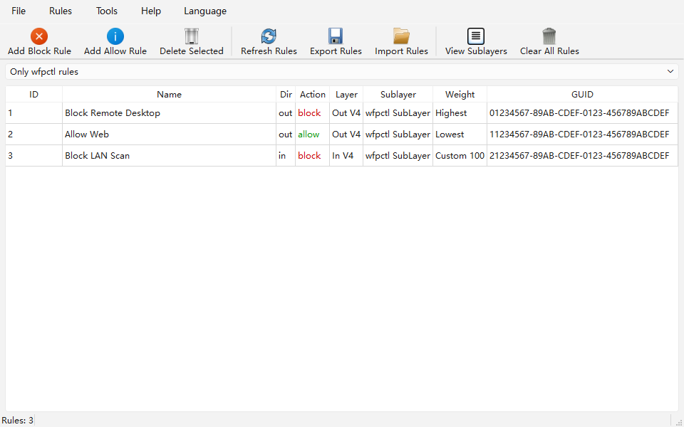
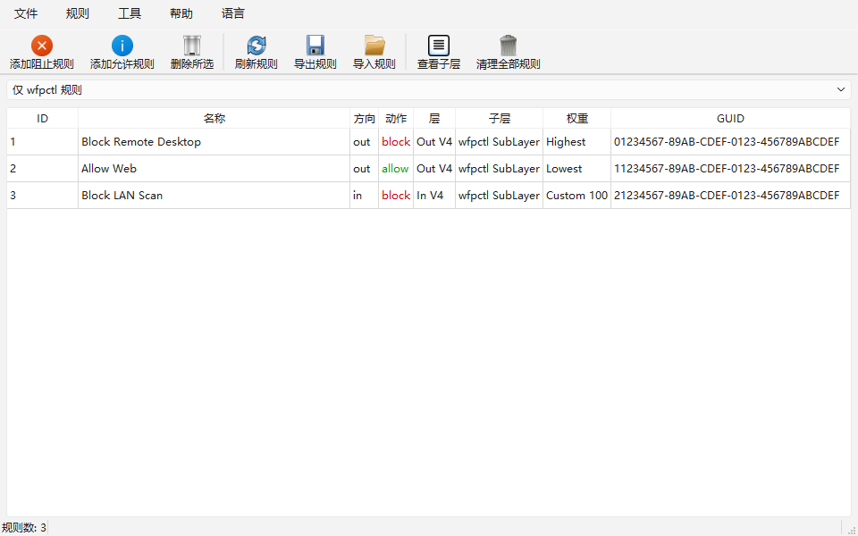

# wfpctl

`wfpctl` is a native Windows CLI (Go) for creating and removing inbound/outbound rules on the
[Windows Filtering Platform (WFP)](https://learn.microsoft.com/en-us/windows/win32/fwp/windows-filtering-platform-start-page).
It targets remote IP (or CIDR), port (or port range) and protocol conditions, and is designed to place your
rules at the **highest possible priority** on any machine, adapting to whatever sub-layers already exist.

Copyright (c) 2026 xRetia Labs — <https://github.com/xRetia/wfpctl>

- Pure user-mode: talks to `fwpuclnt.dll` directly (no kernel driver, no service).
- `add` / `delete` / `list` / `sublayers` sub-commands.
- `list` filters by sub-layer (`-sublayer`), shows every provider filter (`-all`), and outputs JSON (`-json`).
- Builds for **amd64**, **386** and **arm64** (x64, x86 and Windows on ARM).
- Optional **PyQt6 GUI** with English / 中文 language switch (see GUI section below).
- Persistent provider + sub-layer and persistent filters (survive reboot).

## Build

Requires Go 1.21+ on Windows. The `VERSION` file at the project root is the single source of truth for
version numbers; the build injects it via `-ldflags`:

```powershell
# amd64
$env:GOARCH='amd64'; go build -trimpath -ldflags "-s -w -X main.versionStr=$(Get-Content VERSION)" -o wfpctl64.exe .

# 386
$env:GOARCH='386'; go build -trimpath -ldflags "-s -w -X main.versionStr=$(Get-Content VERSION)" -o wfpctl32.exe .
```

The release workflow also builds an **arm64** variant (`wfpctl-arm64.exe`) for Windows on ARM.

Run tests / vet:

```powershell
go test ./...
go vet ./...
```

Adding or deleting WFP filters requires Administrator privileges.

## Usage

```
wfpctl add      [-name <name>] -target <ip|cidr> [-direction in|out] [-action block|allow]
                [-protocol tcp|udp|<number>] [-port <port|range>] [-priority highest|lowest|custom]
                [-weight <uint64>] [-sublayer high|default] [-all-layers]
wfpctl delete   -key <filter-GUID>
wfpctl list     [-json] [-all] [-sublayer <GUID|name>]
wfpctl sublayers [-json] [-delete [-key <sub-layer-GUID>]]
wfpctl version
wfpctl help
```

`wfpctl help` (or no arguments) and every sub-command's `-h`/`--help` show usage; `wfpctl version` shows the
version. Both print the copyright line (`Copyright (c) 2026 xRetia Labs`) and the project URL
(`https://github.com/xRetia/wfpctl`).

Go's flag package accepts both `-flag` and `--flag`.

### Examples

```powershell
# Block outbound to a single IPv4 address, highest priority
wfpctl.exe add -name block-example -target 203.0.113.10 -direction out -action block -priority highest

# Block an entire subnet with a port range and fixed protocol
wfpctl.exe add -name block-range -target 192.168.1.0/24 -direction out -action block -port 80-443 -protocol tcp

# Allow inbound TCP/443 to an IPv6 sub-net, highest priority
wfpctl.exe add -name allow-https -target 2001:db8::/32 -direction in -action allow -protocol tcp -port 443

# Custom uint64 filter weight (higher wins within the same sub-layer)
wfpctl.exe add -name custom-rule -target 203.0.113.20 -priority custom -weight 500000

# Use the system default sub-layer instead of wfpctl's own priority sub-layer
wfpctl.exe add -name plain-rule -target 203.0.113.30 -direction out -action block -sublayer default

# Allow ALL TCP traffic (v4), both directions, highest priority
# WARNING: as a terminating `allow` at weight 65535, this short-circuits every
# lower sub-layer — including the Windows Filtering Platform's own assessment of
# inbound/outbound TCP. Only use when you fully intend HTTP/HTTPS/etc. to bypass
# all other (block) rules. IPv6 is unaffected by 0.0.0.0/0.
wfpctl.exe add -name allow-all-tcp-out -target 0.0.0.0/0 -direction out -action allow -protocol tcp -port 1-65535
wfpctl.exe add -name allow-all-tcp-in  -target 0.0.0.0/0 -direction in  -action allow -protocol tcp -port 1-65535

# Place the same rule on every relevant WFP layer for this direction (ALE
# auth + redirects, transport, IP packet, stream, flow-established). Use this
# to overtake rules a competing firewall product added at *other* layers: a
# hard-permit only clears action rights within its own layer, so it must be
# present on every layer the other product uses.
wfpctl.exe add -name block-every-layer -target 203.0.113.10 -direction out -action block -all-layers
# `allow` works the same way: the permit + CLEAR_ACTION_RIGHT lands on every layer too.
wfpctl.exe add -name permit-every-layer -target 203.0.113.10 -direction in -action allow -all-layers
```

Rules are matched by AND: the action applies only when *all* given conditions hold.
Omit `-port` and/or `-protocol` to skip those conditions.

### Flags

| Flag | Meaning | Default |
| --- | --- | --- |
| `-name` | Human-readable rule name | `wfpctl-rule` |
| `-target` | Remote IP or CIDR, v4 or v6 (a plain IP becomes a /32 or /128 subnet) | required |
| `-direction` | `in` or `out` | `out` |
| `-action` | `block` or `allow` | `block` |
| `-protocol` | `tcp`, `udp`, or a protocol number 0–255 | none |
| `-port` | Remote port (`80`) or range (`80-443`) | none |
| `-priority` | `highest`, `lowest`, or `custom` | `highest` |
| `-weight` | Custom uint64 filter weight for `-priority custom` | `0` |
| `-sublayer` | `high` (own priority sub-layer) or `default` (built-in sub-layer) | `high` |
| `-all-layers` | Also place the rule on redirect, transport, IP-packet, stream and flow-established layers (per direction/version). Conditions the layer does not expose (e.g. `-port` on IP-packet layers) are skipped, never rejected. | `false` |

### Deleting

```powershell
# GUID printed by `list`; braces are optional
wfpctl.exe delete -key 203AB74A-63CE-4A3B-BF4C-8B7AE6AC21E4
```

### Listing

`list` prints only the filters owned by the `wfpctl Provider`:

```
SUBLAYER           ID     NAME          DIRECTION  ACTION  WEIGHT  GUID
wfpctl SubLayer    67939  subnet-test   in         allow   18446744073709551615 {0335BED5-05BD-4CAD-8C30-1229AC1E4BE3}
```

- `-all` also lists filters in other sub-layers (still restricted to the `wfpctl Provider`).
- `-sublayer <GUID|name>` lists the provider's filters in one specific sub-layer, whether it is
  wfpctl's own sub-layer or a built-in one. The selector may be a full GUID or an exact (case-insensitive)
  sub-layer name.

`weight` is the filter's weight inside its sub-layer (`18446744073709551615` = `math.MaxUint64` for `highest`).

Add `-json` for structured output (consumed by the GUI), which adds `sublayer`/`protocol`/`port`/`target`:

```json
[
  {
    "id": 67939,
    "name": "subnet-test",
    "direction": "in",
    "action": "allow",
    "layer": "ALE_AUTH_RECV_ACCEPT_V4",
    "sublayer": "wfpctl SubLayer",
    "weight": "18446744073709551615",
    "target": "10.0.0.0/24",
    "port": "",
    "protocol": "",
    "key": "0335BED5-05BD-4CAD-8C30-1229AC1E4BE3"
  }
]
```

### Inspecting sub-layers

`sublayers` enumerates every sub-layer sorted descending by weight, so you can see who holds the high
weights on a given machine. The `GUID` column shows the bare sub-layer key (no braces), ready to copy into
`sublayers -delete -key`. Entries with weight `>= 32768` (at or above the built-in
`FWPM_SUBLAYER_UNIVERSAL` sub-layer) are marked with a trailing `*`. Add `-json` for a structured
`[{weight, name, key}, ...]` list:

```
WEIGHT  NAME                     GUID
65535  wfpctl SubLayer           5AF52F9C-EE4D-4A9F-8599-94F0F59E289B  *
49152  RPC Audit Sub-Layer       758C84F4-FB48-4DE9-9AEB-3ED9551AB1FD  *
...
32768  Universal Sub-Layer       EEBECC03-CED4-4380-819A-2734397B2B74  *
...
```

(Built-in sub-layer display names are localized to the OS language.)

WFP arbitrates filters per layer: sub-layers are ordered by their `UINT16` weight (max `65535`) and traffic
traverses them highest-to-lowest; inside a sub-layer, filters are ordered by their (64-bit) `weight`.
Terminating actions (`block` / `allow`) stop evaluation, and a hard `block` in a higher sub-layer beats an
`allow` in a lower one.

`wfpctl` therefore:

1. Registers a persistent **provider** `wfpctl Provider` `{502b4bcd-7bf4-4e46-b006-0c8bab4a2765}`.
2. Registers a persistent **sub-layer** `wfpctl SubLayer` `{5af52f9c-ee4d-4a9f-8599-94f0f59e289b}`.
3. **Dynamically picks the highest free sub-layer weight**: `65535` when free; otherwise it scans
   `65534, 65533, ...` for the first free weight and prints who currently holds the higher weights, so the
   tool stays maximally prioritized on machines where a weight is already taken.
4. Adds filters into that sub-layer with a `uint64` filter weight (default `math.MaxUint64`), so yours win
   over every rule in any lower sub-layer.

Every **permit** (`-action allow`) filter is additionally flagged `FWPM_FILTER_FLAG_CLEAR_ACTION_RIGHT` (0x8),
which gives it a **hard permit** semantics **scoped to the current layer**: on a match, the flag clears the
filter's action rights so lower sub-layers *in the same layer* can no longer change the outcome (a plain
permit is only a *soft* permit that a lower sub-layer's `block` can override). Block filters are already
"hard" by default in the engine, so no flag is needed on them.

This is **not** a global override of the machine's firewall. WFP evaluates each layer independently and a
connection passes through several layers in order. wfpctl adds its rules to the `ALE_AUTH_*` layers
(`ALE_AUTH_CONNECT_V4/V6`, `ALE_AUTH_RECV_ACCEPT_V4/V6`); therefore a hard allow only shields that
connection from lower sub-layers *within* those `ALE_AUTH_*` layers. It cannot undo:

- traffic already redirected / pended / absorbed / reset by a callout in an **earlier** layer, such as
  `ALE_CONNECT_REDIRECT`, `ALE_BIND_REDIRECT`, `OUTBOUND`/`INBOUND_TRANSPORT`, `STREAM`, or
  `INBOUND`/`OUTBOUND_IPPACKET`;
- a TCP `RST` already injected by a kernel callout (for example a `FWP_ACTION_CALLOUT_TERMINATING` /
  `FWP_ACTION_CALLOUT_UNKNOWN` filter whose final action the callout driver decides);
- connections created later by a proxy / VPN / TUN, which are new connections that never matched the
  original `ALE_AUTH_*` filter in the first place.

To overtake a vendor at all of these layers at once, add the rule with `-all-layers`: the same
block/allow is placed on the ALE auth, redirect (`ALE_CONNECT_REDIRECT` / `ALE_AUTH_RECV_ACCEPT_REDIRECT`),
transport, IP-packet, stream and flow-established layers for the requested direction and IP version.
Because a hard permit is layer-local, this is how a single `wfpctl add` command can shield a connection
from a vendor working in *any* of those layers (at the next layer the vendor's callout can still run, so
this still is not a global override — just a much wider one).

So the practical meaning is: **after a wfpctl hard allow matches, the connection is no longer affected by
lower sub-layers of the same `ALE_AUTH_*` layer, but it can still have been redirected or terminated by a
vendor working in earlier `ALE_*` layers, and can still re-enter that vendor on later transport/stream
layers.** When troubleshooting a vendor that still blocks you, compare the WFP `netevent` layer of the
block/RST, the layer of the vendor's filters, and the layer of your `wfpctl` rule. If the RST was raised in
`ALE_CONNECT_REDIRECT`, `OUTBOUND_TRANSPORT`, or `STREAM` while your rule sits in `ALE_AUTH_CONNECT`, the
hard flag is working correctly — it just is not global.

The flag only changes the arbitration override rights of an action within a layer — it is unrelated to ACL
permissions and does **not** stop `wfpctl delete`; filters remain removable via `FwpmFilterDeleteByKey0`.

Note: `65535` is the maximum `UINT16` sub-layer weight — if another vendor already registered `65535`, a
tie is unavoidable (order among equal weights is unspecified). The tool then prints who holds the higher
weights and falls back to the highest free weight below it.

### Uninstalling

```powershell
# Remove wfpctl's own sub-layer entirely
wfpctl.exe sublayers -delete

# Remove any sub-layer by its GUID (from the `sublayers` listing)
wfpctl.exe sublayers -delete -key 5AF52F9C-EE4D-4A9F-8599-94F0F59E289B
```

`wfpctl sublayers -delete` (no `-key`) cleans up wfpctl's own installation:

1. Deletes every wfpctl filter still sitting in the `wfpctl SubLayer`.
2. Deletes the `wfpctl SubLayer` itself.
3. Deletes the `wfpctl Provider`.

The next `add` recreates provider + sub-layer automatically (re-picking the highest free weight).

`wfpctl sublayers -delete -key <GUID>` deletes a single sub-layer by its GUID. It first removes every filter
still bound to it (regardless of owner), then deletes the sub-layer itself. If the GUID matches wfpctl's own
sub-layer, only the sub-layer and its filters are removed (the provider stays).

## GUI

An optional PyQt6 GUI is available in `gui/`. It calls the CLI backend and provides:

- Toolbar with icon buttons: block / allow / delete / refresh / export / import / sublayers / uninstall
- Rule table with right-click context menu (delete, copy GUID, refresh)
- Sublayer filter drop-down: show only wfpctl rules, all sublayers, or a specific sublayer
- Rule table columns for ID / name / direction / action / layer / sublayer / weight / GUID
- Add-rule dialog with fields for name, target, port, protocol, direction, action, priority,
  plus an *"Apply to all relevant layers"* checkbox (maps to the CLI's `-all-layers`)
- Export / import rules as JSON
- Sublayer viewer with delete support
- Status bar with rule count and operation feedback
- **Bilingual UI** — English (default) and Chinese (中文). The language is switched via the
  **Language / 语言** menu and persists across launches.

| English | 中文 |
| --- | --- |
|  |  |

Build from `gui/`:

```powershell
pip install PyQt6 pyinstaller
pyinstaller --onefile --windowed --name wfpctl-gui gui/wfpctl_gui/__main__.py
```

The GUI auto-elevates to Administrator on launch. It looks for `wfpctl.exe` (or `wfpctl64.exe` /
`wfpctl32.exe`) in the same directory as the GUI executable, then falls back to `PATH`.

## How it works

- All WFP entry points are bound at runtime with `golang.org/x/sys/windows` `LazyDLL("fwpuclnt.dll")`
  (`FwpmEngineOpen0`, `FwpmProviderAdd0`, `FwpmSubLayerAdd0`, `FwpmSubLayerGetByKey0`,
  `FwpmSubLayerCreateEnumHandle0`/`FwpmSubLayerEnum0`, `FwpmFilterAdd0`, `FwpmFilterDeleteByKey0`,
  `FwpmFilterCreateEnumHandle0`/`FwpmFilterEnum0`/`FwpmFilterDestroyEnumHandle0`).
- Builds natively for both **amd64** and **386**. The `filter` struct layout is verified at test time for each
  architecture (amd64: 200 bytes; 386: 144 bytes).
- Enumerations use the two-step `FwpmFilterCreateEnumHandle0`/`FwpmFilterEnum0` pattern (a NULL template
  enumerates everything; results are a pointer-array `FWPM_FILTER0 **`, so entries are dereferenced twice).
- Address conditions: IPv4 uses `FWP_V4_ADDR_MASK{addr, mask}` where `mask` is the **netmask bit pattern in
  host byte order** (e.g. `0xFFFFFF00` for /24, not the prefix length); IPv6 uses `FWP_V6_ADDR_MASK` with a
  prefix-length byte.
- Port ranges expand to two AND'd conditions: `FWP_MATCH_GREATER_OR_EQUAL` (3) on the lower bound and
  `FWP_MATCH_LESS_OR_EQUAL` (4) on the upper bound; a single port uses `FWP_MATCH_EQUAL`.
- `FWPM_FILTER0` is laid out with an explicit 16-byte `rawContext` union so the trailing `filterId` field
  reads at the correct offset when enumerating.

## Troubleshooting

- **Running through `gsudo`**: `gsudo64.exe` rewrites arguments that contain braces (`{...}`) into a
  PowerShell `-encodedCommand` invocation and the original argument is lost. Pass filter GUIDs *without*
  braces when elevating through gsudo (`wfpctl delete -key <GUID>`). Our parser accepts either form.
- **`FwpmFreeMemory0` returning `0xbadbadfabadbadfa`**: BFE reports "already freed" for single objects
  returned by `Fwpm*GetByKey0` on some systems. `wfpctl` verifies existence with GetByKey but never frees
  the result (a short-lived CLI — memory is reclaimed by BFE when the engine session closes).
- **`0x8032001F FWP_E_INVALID_NET_MASK`**: the IPv4 mask is being passed as a prefix length; it must be the
  bit-pattern netmask value. The current CLI always encodes it correctly.

## Notes

- The tool modifies live WFP state. An over-broad high-priority `block` can cut off networking; test in an
  isolated environment first and give every rule a clear name.
- `wfpctl` never deletes objects created by other applications. Deleting requires the exact filter GUID.
- Provider and sub-layer GUIDs are fixed constants; create the provider/sub-layer once (persistent) and only
  add/remove filters afterwards.